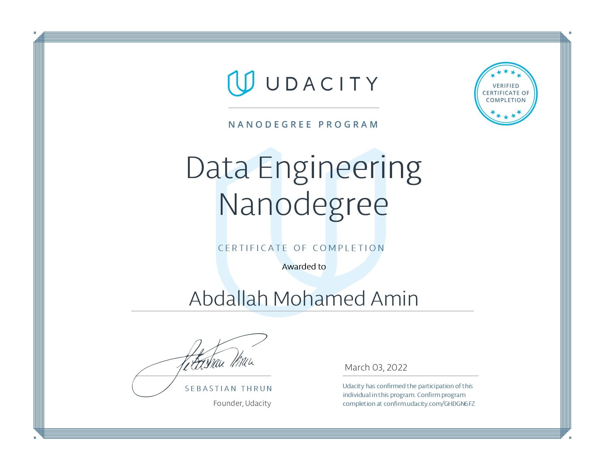

# Data-Engineering-Nanodegree-Program-projects
# Connect with me! 💼

[Nanodegree-Program-link](https://www.udacity.com/course/data-engineer-nanodegree--nd027)

The Udacity Nanodegree Graduation [Certificate](https://graduation.udacity.com/confirm/GHDGN6FZ) 🥰❤️🧑‍🎓

This Nanodegree help to learn very valuable different topics related to Data Engineering. which helps to design data models, build data warehouses and data lakes, automate data pipelines, and work with massive datasets. At the end of the program, we’ll combine our new skills by completing a capstone project.
Educational Objectives: we will learn the following:

* Create user-friendly relational and NoSQL data models
* Create scalable and efficient data warehouses
* Work efficiently with massive datasets 
* Build and interact with a cloud-based data lake 
* Automate and monitor data pipelines
* Develop proficiency in Spark, Airflow, and AWS tools

The Syllabus is [here](https://d20vrrgs8k4bvw.cloudfront.net/documents/en-US/Data+Engineering+Nanodegree+Program+Syllabus.pdf)

- 1- Data Modeling:
Learn to create relational and NoSQL data models. Use ETL to build databases in PostgreSQL and Apache Cassandra.
    * [Project 1](https://github.com/abdallah-elsawy/Data-Engineering-Nanodegree-Program-projects/tree/main/1-Data%20Modeling%20with%20Postgres): Data Modeling with Postgres
    * [Project 2](https://github.com/abdallah-elsawy/Data-Engineering-Nanodegree-Program-projects/tree/main/2-Data%20Modeling%20with%20Cassandra): Data Modeling with Apache Cassandra

- 2- Cloud Data Warehouses and AWS Redshift :
    * [Project 3](https://github.com/abdallah-elsawy/Data-Engineering-Nanodegree-Program-projects/tree/main/3-Data%20Warehouse%20(AWS%20Redshift)): Data Warehouse

- 3- Data Lakes with EMR clusters and Pyspark
    * [Project 4](https://github.com/abdallah-elsawy/Data-Engineering-Nanodegree-Program-projects/tree/main/4-Data%20Lake%20(Spark)): Data Lake

- 4- Data Pipelines with Airflow
    * [Project 5](https://github.com/abdallah-elsawy/Data-Engineering-Nanodegree-Program-projects/tree/main/5-Data%20Pipelines%20with%20Airflow): Data Pipelines with Airflow

- 5- Capstone Project 
    * [Project 6](https://github.com/abdallah-elsawy/Data-Engineering-Nanodegree-Program-projects/tree/main/6.%20Data%20Engineering%20Capstone%20Project): (Climate change and Immigration)
